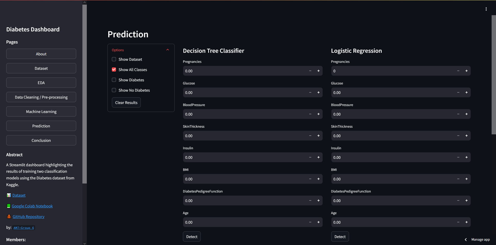

# Diabetes Dashboard using Streamlit

A Streamlit web application that performs Exploratory Data Analysis (EDA), Data Preprocessing, and Supervised Machine Learning to classify Diabetes outcome from the Diabetes dataset (Diabetes and No Diabetes) using Decision Tree Classifier and Logistic Regression.

### 🔗 Links:

- 🌐 [Streamlit Link](https://miguel-lopez-06-streamlit-diabetes-dashbo-dashboard-main-i6jzrc.streamlit.app/#b19d2133)
- 📗 [Google Colab Notebook](https://colab.research.google.com/drive/1UWI3jhR9aK2h7xXVTs4qAiTrXt3dyOSu?usp=sharing)

### 📊 Dataset:

- [Diabetes Dataset (Kaggle)](https://www.kaggle.com/datasets/mathchi/diabetes-data-set)

### 📖 Pages:

1. `Dataset` - Brief description of the Diabetes dataset used in this dashboard. 
2. `EDA` - Exploratory Data Analysis of the Diabetes dataset. Highlighting the distribution of Diabetes and the relationship between the features. Includes graphs such as Pie Chart, Histogram, Box Plot, and Scatter Plot.
3. `Data Cleaning / Pre-processing` - Data cleaning and pre-processing steps such as encoding the outcome column and splitting the dataset into training and testing sets.
4. `Machine Learning` - Training two supervised classification models: Decision Tree Classifier and Logistic Regression. Includes model evaluation, Feature Importance, Confusion Matrix and ROC Curve.
5. `Prediction` - Prediction page where users can input values to predict the Diabetes outcome using the trained models.
6. `Conclusion` - Summary of the insights and observations from the EDA and model training.

### 💡 Findings / Insights

Through exploratory data analysis and training of two classification models (Decision Tree Classifier and Logistic Regression) on the Diabetes dataset, the key insights and observations are:

#### 1. 📊 **Dataset Characteristics**:
- The dataset comprises various medical attributes such as Glucose, Blood Pressure, BMI, and Age, which show varying levels of distribution among individuals with and without diabetes. The 'Outcome' variable indicates whether a person has diabetes (1) or not (0), providing a balanced distribution for binary classification.

#### 2. 📝 **Feature Distributions and Separability**:
- A closer examination of feature importance highlighted that Glucose levels significantly impact diabetes prediction, as shown by its high feature importance in both models. Other features, such as BMI and Age, also contribute to model predictability, indicating a potential link between these factors and diabetes risk.

#### 3. 📈 **Model Performance (Decision Tree Classifier)**:
- The Decision Tree Classifier achieved an accuracy of 70.13% on the test data. The feature importance analysis revealed that Glucose is the most influential predictor in this model, followed by BMI and Age. While the model shows moderate accuracy, there is a possibility of overfitting, as decision trees can be highly sensitive to training data patterns.

#### 4. 📈 **Model Performance (Logistic Regression)**:
- The Logistic Regression model achieved 78.40% accuracy on the training data and 73.59% accuracy on the test data, showing consistency and generalizability. The feature importance analysis, determined by the model's coefficients, also underscored the significance of Glucose and BMI, with Diabetes Pedigree Function and Age contributing to prediction accuracy.

##### **Summing up:**  
Throughout this data science exercise, both models demonstrated the potential for classifying diabetes status based on available medical attributes. The Logistic Regression model proved more robust, with higher accuracy and AUC scores, indicating it may be better suited for this dataset. This analysis suggests that Glucose, BMI, and Age are vital indicators of diabetes risk, supporting the importance of these features in predictive healthcare models. Further tuning and cross-validation could enhance the performance and reliability of these models in clinical applications. 
